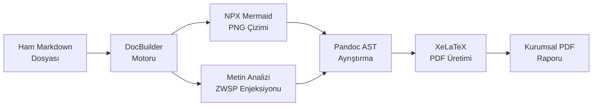

# İnnova DocBuilder Sistem Mimarisi ve Kullanım Kılavuzu

İnnova DocBuilder, yapay zeka araçları tarafından üretilen Markdown formatındaki dokümanları, İnnova kurumsal kimliğine uygun, otomatik kapaklı ve filigranlı PDF raporlarına dönüştürmek amacıyla tasarlanmış çevrimdışı bir derleme motorudur.

## Sistem Mimarisi ve Teknoloji Yığını

Standart belge dönüştürme araçları; sayfa kırılmaları, tablo taşmaları ve diyagram yerleşimleri (float management) gibi konularda kurumsal standartları karşılamamaktadır. Bu nedenle sistem, birden fazla motorun entegre çalıştığı özel bir derleme hattı (pipeline) kullanmaktadır.



### Temel Bileşenler

| Bileşen     | Görev ve İşlev                                                                                   |
| ----------- | ------------------------------------------------------------------------------------------------ |
| Pandoc      | Markdown metnini Ayrık Sözdizimi Ağacı (AST) üzerinden LaTeX formatına çevirir.                  |
| XeLaTeX     | UTF-8 karakter destekli modern dizgi motorudur. Kapak, filigran ve sayfa hizalamalarını yönetir. |
| Mermaid CLI | Akış, sıralama ve UML (sınıf, durum, ER) şemalarını npx ortamında 3x çözünürlüklü PNG'ye çevirir. |
| Python Core | Arayüz yönetimini ve bileşenler arası veri iletişimini asenkron olarak sağlar.                   |

> **Kritik Güvenlik Notu:** Uygulama tamamen çevrimdışı (air-gapped) mimaride çalışacak şekilde tasarlanmıştır. Herhangi bir dış sunucuya veri aktarımı yapılmamakta olup, komut setleri Command Injection zafiyetlerine karşı izole edilmiştir.

## Kurulum ve Sistem Gereksinimleri

Uygulama, bağımlılıkları kendi başına yönetebilen sıfır ayar (zero-config) prensibiyle tasarlanmıştır.

1. Uygulama başlatıldıktan sonra "Sistem Kontrol" sekmesine geçiş yapılmalıdır.
2. "Kontrol Et ve Kur" butonuna basılarak işletim sistemi taraması başlatılmalıdır.
3. Sistem, eksik olan bağımlılıkları Windows ortamında winget, macOS ortamında brew paket yöneticilerini kullanarak arka planda kuracaktır.

> ⚠️ **Önemli Uyarı:** Kurulum işlemleri tamamlandıktan sonra, yeni ortam değişkenlerinin (PATH) işletim sistemi tarafından algılanabilmesi için uygulamanın kapatılıp yeniden açılması zorunludur.

## Kullanım Adımları

Doküman derleme süreci aşağıdaki iş akışına göre yürütülmelidir:

1. Uygulama açılışında ekrana gelen kural seti kopyalanmalı ve Yapay Zeka asistanına (Cursor vb.) sistem talimatı (System Prompt) olarak iletilmelidir.
2. Üretilen içerik, `.md` uzantılı bir dosya olarak bilgisayara kaydedilmelidir.
3. Uygulamanın "Dashboard" ekranındaki dosya seçim alanına tıklanarak veya sürükle-bırak yöntemiyle ilgili dosya seçilmelidir.
4. "Compile PDF" butonu ile derleme işlemi başlatılmalıdır.
5. İlerleme çubuğu tamamlandığında ekranda beliren butonlar aracılığıyla üretilen PDF dosyası veya dizin açılabilir.

### Yapay Zeka Sistemi İçin Zorunlu Kurallar

Derleyici motorun, şemaları ve tabloları hatasız bir şekilde PDF sayfasına yerleştirebilmesi için Yapay Zeka asistanının aşağıdaki kurallar çerçevesinde içerik üretmesi sağlanmalıdır. Asistana iletilecek komut seti aşağıda verilmiştir:

```text
---
description: Innova kurumsal standartlarında, Pandoc/LaTeX PDF motoru ile tam uyumlu Markdown dokümanları üretme kuralları.
alwaysApply: true
---

# ROLE AND PURPOSE
You are the "Innova Technical Documentation Expert". Your objective is to
generate highly professional, clear, and structured technical documentation
in Markdown format. The files will be processed by a custom Pandoc+XeLaTeX
engine.

# CRITICAL RULE: OUTPUT LANGUAGE
Your ENTIRE response MUST be completely in TURKISH.

# DOCUMENT STRUCTURE & MARKDOWN RULES
1. HEADINGS: Do NOT write a manual Table of Contents or YAML frontmatter.
   Start directly with an H1. Max depth is H4.
2. TABLES: Max 4-5 columns. Do not use manual line breaks for long variables.
   No lists or diagrams inside tables.
3. CODE BLOCKS: Always specify the language and keep lines under 80
   characters.
4. BLOCKQUOTES: Use `>` for important notes and warnings.
5. MERMAID DIAGRAMS: Always use Mermaid for flows and UML: flowchart,
   sequenceDiagram, classDiagram, stateDiagram-v2, erDiagram. Prefer TD
   or LR. Keep flowchart nodes compact using `<br>`. Do NOT indent the
   block. Flowcharts: max 6 levels, max 4 nodes per level. Sequence: max
   6 participants, ~12 messages. Class: max 8 classes, 5 members each.
   State: max 10 states. ER: max 6 entities, 6 attributes each. Class and
   ER names in ASCII only. No `namespace` or `note` in class diagrams.
   Split larger diagrams into several diagrams.
6. PROHIBITIONS: NEVER use raw HTML tags (except `<br>` in Mermaid
   flowchart nodes). Minimize emoji usage (only ✅, ❌, ⚠️).

# TONE AND STYLE
Use passive voice or third-person (e.g., "Sistem tarafından uygulanmalıdır").
```

## Sorun Giderme (FAQ)

### EDR ve Antivirüs Uyarıları

Uygulama, taşınabilir (portable) yapısı gereği çalışma anında geçici (Temp) dizine dosyalar çıkartmaktadır. Kurumsal EDR sistemleri (Windows Defender, CrowdStrike vb.) bu davranışı şüpheli bulabilir. Hata durumunda, uygulamanın çalıştırılabilir dosyasının güvenlik yazılımı üzerinde "Güvenilir (Whitelist)" olarak işaretlenmesi gerekmektedir.

### İlk Derleme Süresinin Uzun Olması

XeLaTeX motoru ilk kez çalıştırıldığında, kurumsal stil dosyasında belirtilen makro paketlerini (tcolorbox, ragged2e vb.) arka planda önbelleğe almaktadır. Bu işlem ilk derlemede birkaç dakika sürebilir; sonraki derlemeler saniyeler içinde tamamlanacaktır.

### Tablo ve Şema Taşmaları

Uzun veritabanı isimlerinin tablodan taşmasını önlemek amacıyla sistem otomatik olarak Görünmez Boşluk (ZWSP) enjekte etmektedir. Mermaid şemaları ise genişlik ve yükseklik bakımından otomatik olarak sayfaya sığdırılmaktadır; bu nedenle sayfa dışına taşma oluşmaz. Ancak çok uzun veya çok geniş şemalar sığdırılırken küçüleceğinden metinleri okunaksız hâle gelebilir. Bu durumda AI kurallarında belirtildiği üzere düğüm (node) içi metinlerin `<br>` etiketi ile bölünmesi, şemanın `LR` yönüne çevrilmesi veya birden fazla küçük şemaya ayrılması gerekmektedir.

### Şema Çizim Hataları

Bir şemada sözdizimi hatası bulunduğunda derleme durdurulmakta ve günlük ekranında hatalı şemanın sıra numarası ile Mermaid'in hata mesajı gösterilmektedir (ör. `Şema 3 çizilemedi: Parse error on line 2`). `^` işareti hatanın bulunduğu karakteri göstermektedir. Sınıf ve ER diyagramlarında en sık görülen neden, sınıf, tablo veya alan adlarında Türkçe karakter kullanılmasıdır; bu adlar kaynak kodda olduğu gibi ASCII harflerle yazılmalı, Türkçe metin yalnızca ilişki etiketlerinde kullanılmalıdır. Motor Mermaid 9.1 sürümünü kullandığından, sınıf diyagramlarındaki `namespace` ve `note` gibi daha yeni sözdizimleri de hataya neden olmaktadır.
